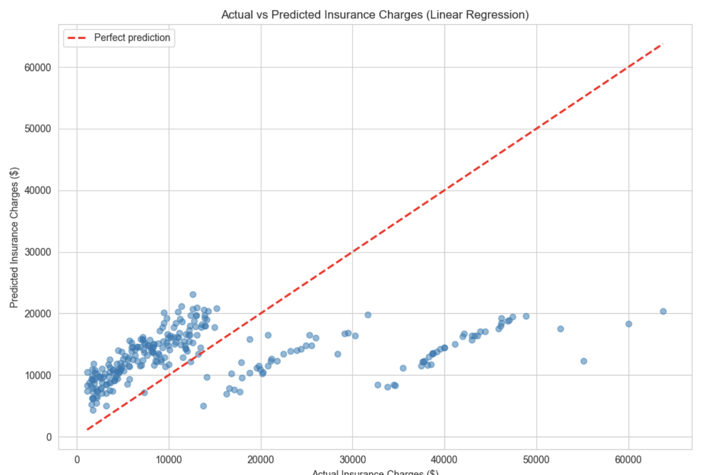

# Medical Insurance Cost Prediction with Linear Regression

## Project Overview
This project builds a multiple linear regression model to predict annual medical insurance charges using three numeric customer features: age, BMI, and number of children.

The aim was not just to train a model, but to understand how far a simple numeric-only feature set can go in explaining insurance costs, and to identify what important information is still missing.

---

## Business Problem
An insurance company wants to estimate a customer's annual medical insurance cost based on their personal and health data.

A reliable model can help the underwriting team:
- estimate fairer premiums
- identify potentially high-cost customers
- support early risk review

---

## Dataset
The dataset contains 1,338 customer-level insurance records (1,337 after removing one duplicate row) with the following columns:

- `age`
- `sex`
- `bmi`
- `children`
- `smoker`
- `region`
- `charges` (target, in USD)

For this project, only the three numeric features were used in the model: `age`, `bmi`, `children`.

---

## Project Objective
**How well can annual medical insurance charges be predicted using only age, BMI, and number of children?**

This project deliberately excludes categorical variables such as `smoker`, `sex`, and `region` in order to focus first on the mechanics and interpretation of multiple linear regression with numeric features only.

---

## Tools Used
- Python 3
- pandas
- NumPy
- matplotlib
- seaborn
- scikit-learn

---

## Workflow
1. Loaded and inspected the dataset
2. Quick EDA — structure, summary statistics, missing values, duplicates
3. Cleaning — removed 1 duplicate row
4. Deep EDA — histogram of charges, scatter plots of each feature vs charges, correlation heatmap, boxplot of smoker vs charges
5. Defined features (`X`) and target (`y`)
6. Split the data into training (80%) and test (20%) sets
7. Trained a multiple linear regression model
8. Interpreted the intercept and coefficients
9. Evaluated the model on unseen test data
10. Visualised actual vs predicted charges

---

## Deep EDA Insights
- **Charges are strongly right-skewed**, with most customers clustered at lower charge levels and a smaller group with very high costs.
- **Age has the strongest numeric relationship with charges** (correlation 0.30) among the three selected features.
- **BMI shows a weaker but still noticeable relationship** (correlation 0.20).
- **Children has almost no direct predictive strength** (correlation 0.07).
- The **correlation heatmap showed no multicollinearity** between the numeric features (max pair correlation 0.11), confirming they are safe to use together.
- The **boxplot of smoker vs charges revealed smoking status as the dominant cost driver** — smokers pay roughly 5x more than non-smokers.

Smoking status is clearly the major missing signal in this model and is the main reason the numeric-only regression has limited predictive power.

---

## Model
The final model used was **Multiple Linear Regression**, producing the equation:

`charges = -$5,095 + ($224 × age) + ($281 × bmi) + ($691 × children)`

---

## Coefficient Interpretation
- **Age ($224):** holding BMI and children constant, each additional year of age increases predicted charges by $224.
- **BMI ($281):** holding age and children constant, each one-unit increase in BMI increases predicted charges by $281. A customer moving from a healthy BMI of 22 to an obese BMI of 32 would see predicted cost rise by roughly $2,810.
- **Children ($691):** holding age and BMI constant, each additional child is associated with $691 higher predicted charges. This coefficient should be interpreted cautiously — children had a correlation of only 0.07 with charges in EDA, suggesting the relationship is weak and the coefficient may be unstable.
- **Intercept (-$5,095):** the mathematical starting point when all features are zero. Not directly interpretable, since a customer with age=0 and BMI=0 is not a real-world case.

---

## Model Performance
Evaluated on unseen test data:

| Metric | Value |
|--------|-------|
| R² Score | 0.1375 |
| MAE | $9,620.93 |
| RMSE | $12,589.41 |

---

## What the Results Mean
The model explains about **14% of the variation in insurance charges**. The remaining 86% is driven by factors not included in the feature set — most clearly, smoking status.

This was expected from EDA. The result is not a modelling failure but an honest demonstration of an important principle:

> **Model performance is bounded by feature quality. You cannot extract strong predictive power from weak or incomplete inputs.**

The high RMSE relative to MAE also indicates the model makes some large errors, particularly for higher-cost customers — consistent with the missing smoker signal.

---

## Key Insight
**R² is not something you "push higher" just by changing algorithms. It improves when the inputs improve.**

Using only age, BMI, and children, the model captures only a limited part of the true cost pattern. The EDA pointed clearly at smoking status as the dominant missing variable, and the residual plot confirmed it visually — high-cost customers form a systematic pattern the model cannot reach.

This project is valuable because it shows:
- how to build and interpret a multiple regression model
- how to diagnose weak performance honestly
- how EDA explains why a model performs the way it does
- why feature selection matters as much as modelling itself

---

## Visualisation

The actual vs predicted plot confirms the low R² visually. High-cost customers are systematically underestimated, providing visual evidence of the missing categorical variable identified in EDA.

---

## Next Steps
The natural extension is to incorporate the categorical features identified during EDA — particularly `smoker`. This requires **one-hot encoding**, which is the logical next learning step. Based on the EDA, adding `smoker` is expected to improve R² substantially.

---

## Final Takeaway
**A model is only as strong as the information you give it. Better features often matter more than a more complex algorithm.**
